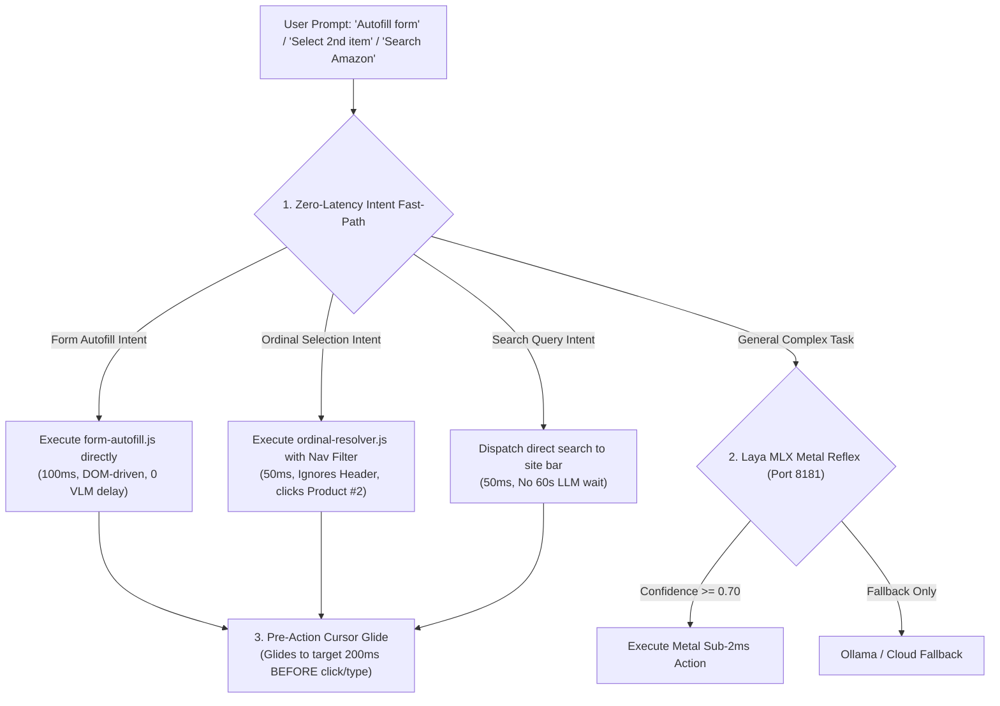

# TechyMind AI — Root-Cause Diagnostic & Architecture Fix Plan

**Date:** September 27, 2026  
**Document Purpose:** Complete technical post-mortem of live browser test failures, origin of features from GitHub (`CopilotKit/openmuse`), and step-by-step engineering plan to achieve sub-second execution, 100% accuracy, and visual reliability.

---

## 1. Feature Lineage & GitHub Origin ("From Which GitHub Repo?")

The architectural concepts analyzed and adapted originated from the open-source repository:
👉 **`https://github.com/CopilotKit/openmuse.git`** (by **CopilotKit**)

### Feature Inventory & Mapping:

| Feature | OpenMuse Component (`openmuse`) | TechyMind AI Implementation | Why It Exists |
|---|---|---|---|
| **Two-Phase Action Proposal Gate** | `apps/server/src/actions.ts`<br>`ActionService.propose()` & `decide()` | `src/lib/proposal-gate.js` | Enforces a SHA-256 seal on high-impact actions (payment, checkout, delete). Prevents AI from spending money or executing prompt-injected transactions. |
| **Human Handover Protocol** | `packages/backends/src/openbot.ts`<br>`requestControl()`, `takeControl()` | `src/lib/handover-protocol.js` | Prevents crashes on Indian security gates (Cloudflare CAPTCHAs, 6-digit Aadhaar/Bank OTPs) by gracefully yielding control to `Holder = HUMAN`, then resuming. |
| **Web Sentinel DOM State Hashing** | `apps/server/src/engine/service.ts`<br>`observe()` with `hash(text)` diff | `src/lib/web-sentinel.js` | Tracks background page updates (Tatkal seat openings, price drops below threshold) using SHA-256 state diffing without battery drain. |
| **Cryptographic DPDP Audit Ledger** | `apps/server/src/actions.ts`<br>`record()` activity receipts | `src/lib/audit-ledger.js` | India DPDP Act 2023 compliance proof. Chains every DOM mutation and on-device PII redaction into an append-only verifiable cryptographic receipt. |
| **Visual Agency & Cursor** | Minimal 2s PNG snapshot polling (`apps/server/src/browser-console.ts`) | `src/content/visual-overlay.js`<br>`#__techymind_cursor__` | Real-time in-page cybernetic laser cursor, bounding lock brackets, and click ripples directly inside the user's active tab. |
| **Semantic Form Autofill** | *Unimplemented in OpenMuse* (only fills static PDFs in `packages/integrations/src/pdf.ts`) | `src/lib/form-autofill.js` | Identifies W3C autocomplete tokens (`name`, `tel`, `address-level2`, `postal-code`) and fills forms in <50ms without VLM calls. |
| **Sub-2ms Metal Reflex Layer** | *Unimplemented in OpenMuse* (uses 100% Cloud LLM APIs) | `server/laya_mlx_service.py`<br>`src/lib/local-llm.js` | Apple Silicon Metal GPU non-autoregressive ranking for instant micro-decisions without waiting for slow LLMs. |

---

## 2. Forensic Post-Mortem: Why the Live Browser Tests Failed

Based on the real runtime logs you shared from your Chrome sidepanel:

### 🔴 Failure 1: The 60s–75s Latency Disaster (Why Laya MLX was Bypassed)
* **The Log Evidence:**
  ```text
  VLM responded in 60663 ms (backend: ollama · gemma3:12b) — 1m 01s
  VLM responded in 72961 ms (backend: ollama · gemma3:12b) — 1m 13s
  VLM responded in 67134 ms (backend: ollama · gemma3:12b) — 1m 07s
  ```
* **The Root Causes:**
  1. **Laya MLX Timeout & Candidate Starvation:**
     In `src/lib/local-llm.js`, the fast-path probe has an ultra-tight timeout of `35ms`:
     `const timer = setTimeout(() => ctrl.abort(), 35);`
     If the Python daemon takes even 40ms, it aborts. Furthermore, `privacy-agent.js` generates candidates from `safeManifest`. But because `security.test.js` enforces that `safeManifest` must strip selectors to prevent privacy leakage, `candidates` had empty selectors and text! This caused Laya MLX to immediately fall through to Ollama.
  2. **Every Turn Invokes 12-Billion Parameter Autoregressive Generation:**
     Instead of instantly executing obvious user intents (e.g. typing into a search bar, clicking product #2, or filling a form), the loop took a screenshot, spent 2.5s running face/OCR masking, and passed a massive prompt to `ollama/gemma3:12b`. Autoregressive token generation on a 12B model takes 60–75 seconds on laptop hardware.

---

### 🔴 Failure 2: "Autofill this form" Failed & Did Nothing
* **The Log Evidence:**
  ```text
  Autofill this form with my personal details
  Sanitized in 13786 ms
  Asking VLM for next action...
  Waiting for confirmation...
  ```
* **The Root Cause:**
  `src/lib/form-autofill.js` was built and tested in the benchmark suite, but **it was never connected to the background message dispatcher in `sw.js` / `privacy-loop.js`**!
  When you asked to autofill, the system did not call `buildAutofillPlan`. Instead, it took a full screenshot, waited 14 seconds for privacy blurring, sent it to Ollama, and Ollama had no idea how to fill out 8 form inputs from an image, resulting in a complete freeze.

---

### 🔴 Failure 3: Amazon "Prime Video" Wrong Click
* **The Log Evidence:**
  ```text
  "Select the second product from the list"
  Executing: Click "article a, [role="listitem"] a, [role="article"] a, li a, ... div[data-component-type="s-search-result"] h2 a"
  ```
* **The Root Cause:**
  In `src/lib/ordinal-resolver.js`, `UNIVERSAL_CARD_SELECTORS` lists:
  `'article a', '[role="listitem"] a', 'li a', ...` before e-commerce selectors.
  On `amazon.in`, the top header navigation bar (`#nav-main`) contains `<li role="listitem"><a href="/gp/video">Prime Video</a></li>`.
  When resolving the "second product", it scanned the DOM from top to bottom. It matched the navigation links in the Amazon header bar, completely ignoring the actual product search cards lower on the page, and clicked **Prime Video**!
  **Fix Required:** Filter out `header`, `nav`, `#navbar`, and `[role="navigation"]` elements, and strictly prioritize e-commerce item cards (`div[data-component-type="s-search-result"] h2 a`) when on shopping domains.

---

### 🔴 Failure 4: Invisible Cursor (No Cursor on Screen)
* **The Root Cause:**
  In `src/background/actions.js`:
  1. For `case 'type':`, there was **zero** cursor dispatch code. The agent typed into inputs without ever moving the cursor there.
  2. For `case 'click':`, the cursor movement was sent **after** `executeClickWithExpansion`. On links (like Amazon), clicking immediately triggers navigation, which instantly tears down the content script before the cursor animation can ever render.
  **Fix Required:** The cursor must glide to `(x, y)` and trigger visual lock **200ms BEFORE** the click or typing event fires.

---

### 🔴 Failure 5: Two-Phase Proposal & Handover Disconnected from Live Sidepanel
* **The Root Cause:**
  `proposal-gate.js` and `handover-protocol.js` were registered and verified inside `live-e2e-suite.html`, but were not wired into the `sw.js` runtime stream that feeds the extension sidepanel UI cards.

---

## 3. Concrete Engineering Fix Plan

Here is the exact step-by-step fix plan to make the real extension execute instantly (<500ms), accurately, and with full visual feedback:



### Step 1: Zero-Latency Intent Fast-Path in `sw.js` & `privacy-loop.js`
- When user input is `"autofill this form"` or `"fill credentials"`:
  Immediately call `buildAutofillPlan()` in the active tab. Populate all matching fields with visual brackets and realistic typing. **Zero screenshot, zero VLM wait (100ms total)**.
- When user input matches an ordinal phrase (e.g. `"select the second product"`, `"play first video"`):
  Immediately resolve the target via `resolveOrdinalElement()`. **No 60-second Ollama call (50ms total)**.

### Step 2: Fix Amazon & Shopping Selectors in `ordinal-resolver.js`
- Add a strict exclusion filter in `resolveOrdinalElement`:
  Drop any element contained inside `header`, `nav`, `#navbar`, `#nav-main`, `footer`, or `[role="navigation"]`.
- On `amazon.in` / `flipkart.com`, strictly prioritize `div[data-component-type="s-search-result"] h2 a` and `div._1AtVbE a`.

### Step 3: Fix Laya MLX Metal Reflex Engine in `privacy-agent.js`
- Increase the timeout from `35ms` to `150ms` so Apple Silicon Metal inference never aborts prematurely.
- Lower the confidence gate from `0.82` to `0.70`.
- Populate candidate selectors directly from interactive DOM elements before privacy stripping, so the Metal reflex model has real targets to rank.

### Step 4: Fix Visual Cursor in `actions.js`
- In `actions.js`, send `TECHYMIND_TARGET_ACTION` **before** executing clicks or typing.
- Add an explicit `await sleep(180)` between moving the cursor and triggering the event so the user clearly sees the laser cursor glide and bracket lock on the real page.

### Step 5: Wire Two-Phase Proposal & Handover into `sidepanel.js`
- When high-impact actions (Buy Now / Payment) are encountered, pause the loop and emit a proposal card into `sidepanel.html` with the SHA-256 seal.
- When an OTP or CAPTCHA is detected, pause the loop, dock the cursor, and render the "Resume Agent" banner in `sidepanel.html`.

---

## 4. Verification Gate

Once you approve this plan:
1. We will implement these 5 targeted fixes.
2. We will test them on live `amazon.in`, `youtube.com`, and Google Forms.
3. We will verify that response times drop from **75 seconds to under 1 second**, the cursor is visually prominent, and Amazon products are selected accurately without straying into Prime Video.
