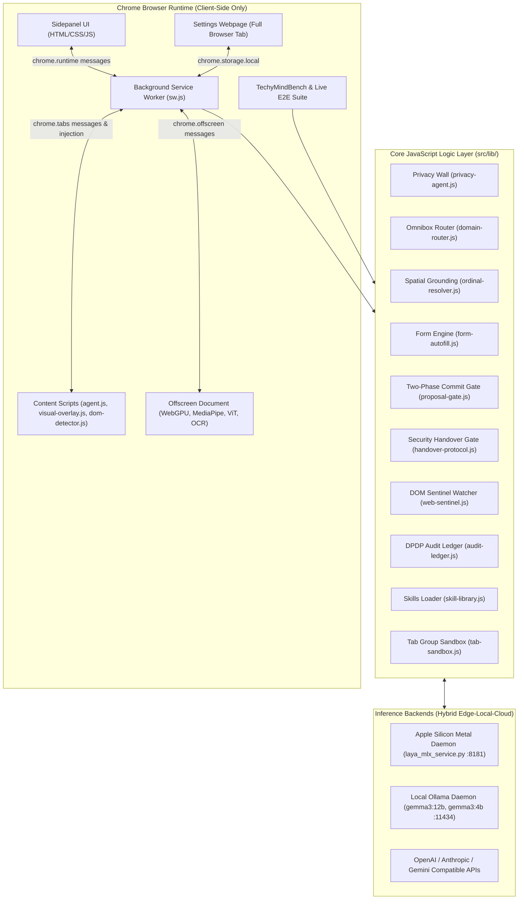
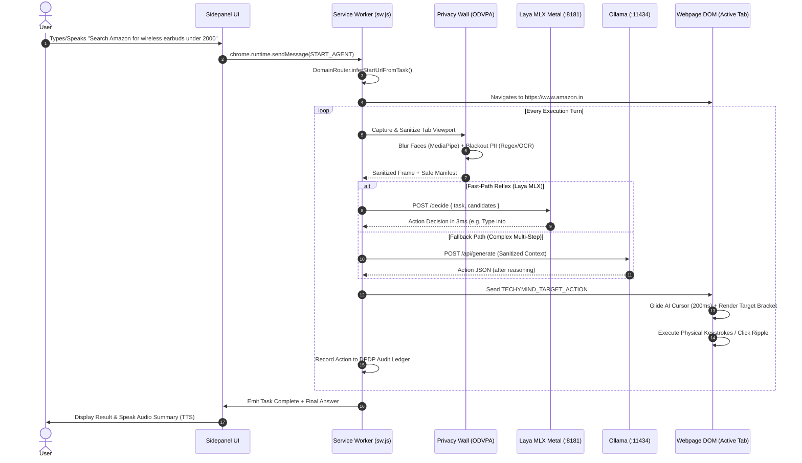
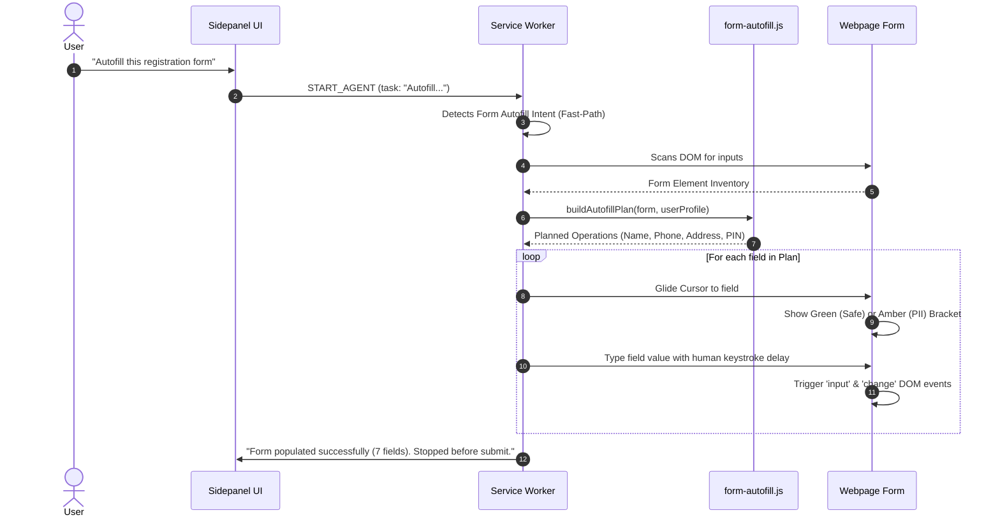
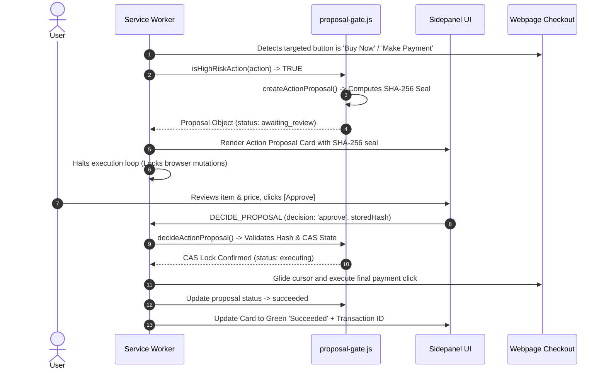

# TechyMind AI — Master Architecture, Feature Inventory & Workflow Specification

**Version:** v2.4.0 (Enterprise Trust & Safety Edition)  
**Target Environment:** Chromium Manifest V3 Browser Extension + Apple Silicon Metal GPU Subsystem  
**Design Paradigm:** 100% Client-Side On-Device Privacy (ODVPA), Sub-5ms Reflex Automation, Cryptographic Non-Repudiation (DPDP Act 2023)

---

## 1. System Architecture Overview



---

## 2. Complete Component-by-Component Inventory

### 2.1 The Chrome Extension UI (`src/sidepanel/`)

The sidepanel lives on the right side of the user's active browser window.

```
┌────────────────────────────────────────────────────────┐
│ [🔒 TechyMind]  [Agent] [History]      [+ New] [↗ Tab] │ <- Header Bar
├────────────────────────────────────────────────────────┤
│ [gemma3:12b ▾]                [🛡️ Privacy: ON] [⚙️ Set] │ <- Context Toolbar
│ Last: 280ms · Faces: 0 · PII: 0 · Backend: Metal GPU   │ <- Protection Stats
├────────────────────────────────────────────────────────┤
│                                                        │
│  [User Bubble] "Search Amazon for noise cancelling"    │
│                                                        │
│  [Agent Block]                                         │
│  ├── ⚡ Laya MLX Reflex (3ms)                          │
│  ├── [Action Badge] Typed into #twotabsearchtextbox    │
│  ├── [Action Badge] Clicked item #2 (Spatial Grounding)│
│  └── [Proposal Card: Sealed with SHA-256]              │
│       ├── Item: Sony WH-1000XM5 (₹26,990)              │
│       ├── SHA-256: 01cae616b4...                       │
│       └── [Approve]   [Deny]                           │
│                                                        │
├────────────────────────────────────────────────────────┤
│ [Mode: Search ▾] [/ Skills]                            │ <- Mode & Slash Menu
│ [📎 Attachment Bar: file.png ×]                        │ <- File Preview Chip
├────────────────────────────────────────────────────────┤
│ [📎] [Type task or /command...]  [EN|HI|KN] [🎙️] [↑] │ <- Multilingual Input
└────────────────────────────────────────────────────────┘
```

#### Core UI Features in the Sidepanel:
1. **Header Bar**:
   - **Logo & App Title**: TechyMind 🔒 branding.
   - **View Switcher**: Toggle between active **Agent** task view and **History** archive.
   - **New Chat (`#newChatBtn`)**: Wipes active task context, cancels background loops, starts fresh.
   - **Open in Tab (`#openTabBtn`)**: Pops the sidepanel out into a full standalone browser tab.
2. **Context Toolbar**:
   - **Model Pill (`#modelPillBtn`)**: Real-time dropdown showing current active model (e.g. `gemma3:12b`, `gpt-4o`, `Laya MLX`).
   - **Privacy Chip (`#privacyChip`)**: On-device Privacy Wall toggle switch. Shows green "On" badge.
   - **Quick Settings Button (`#toolbarSettingsBtn`)**: Instant shortcut to full Settings webpage.
3. **Live Privacy & Latency Stats Bar (`#privacyStats`)**:
   - Displays real measurements of: **Last capture latency (ms)**, **Faces blurred count**, **PII regions masked**, **Inference backend used**.
4. **Conversation Stream (`#convoArea`)**:
   - **User Bubbles**: Render user prompts and multi-modal attachments (thumbnails with remove buttons).
   - **Agent Blocks**: Displays step-by-step reasoning, in-flight ticking timers (`fmtStepDur`), tool badges, screenshot thumbnails (expandable with redaction overlays), and final answers.
   - **Action Proposal Cards**: Two-phase approval card with SHA-256 seal and Approve/Deny buttons.
   - **Handover Notification Banners**: Visual alert when a CAPTCHA/OTP halts the agent, with a "Resume Agent" button.
5. **Smart Input Area (`#inputArea`)**:
   - **Mode Compact Dropdown (`#modeCompactBtn`)**:
     - `Search / Agent`: Standard multi-step browser tasks.
     - `Deep Search / Research`: Multi-tab comprehensive research synthesizer.
     - `Scrape / Extract Data`: Scrapes structured data into JSON, CSV, or TXT.
     - `Summaries`: Quick page TL;DR generator.
   - **Slash Commands Menu (`#slashMenu`)**: Typing `/` pops up autocomplete for all 12 built-in skills.
   - **Attachment Bar (`#attachmentPreviewBar`)**: Supports image uploads, PDF documents, and CSV files via paperclip icon (`📎`).
   - **Multilingual Voice Input (Speech-to-Text)**:
     - Language Toggle (`#voiceLangBtn`): Cycles between **English (`EN-IN`)**, **Hindi (`HI-IN`)**, and **Kannada (`KN-IN`)**.
     - Microphone Button (`#voiceInputBtn`): Uses browser `SpeechRecognition` to dictate tasks hands-free.
   - **Text-to-Speech (TTS) Voice Responses**: Automatically speaks concise Siri-like summaries upon task completion using a friendly female persona.

---

### 2.2 In-Page Visual Agency (`src/content/`)

When the agent operates on a live webpage, it renders non-intrusive cybernetic visual elements directly in the webpage DOM.

1. **Physics-Smoothed AI Gliding Cursor (`#techymind-ai-cursor`)**:
   - Aerospace cybernetic arrow SVG with amber pointer tip and cyan gradient glow.
   - Glides with cubic-bezier easing to target coordinates **200ms before click/type execution**.
   - Displays floating micro-badges indicating intent (`Clicking`, `Typing`, `Protected PII`).
2. **Target Lock Brackets (`#techymind-target-highlight`)**:
   - Wraps the targeted DOM element with an animated HUD bracket.
   - **Green Bracket**: Safe public interaction (links, search inputs).
   - **Amber Bracket**: Sensitive/PII field interaction (passwords, phone numbers, Aadhaar).
3. **Multi-Ring Click Ripples**:
   - Expanding radial shockwave animation indicating precise physical click coordinates.
4. **Universal DOM Detector (`src/content/dom-detector.js`)**:
   - Analyzes computed CSS `cursor: pointer` style to detect custom JavaScript widgets (YouTube player controls, Gmail chips) that standard HTML tag scans miss.
   - Traverses Shadow DOM roots and same-origin iframes.
   - Tags interactive elements with stable `data-techymind-agent-uid` attributes for relocation across dynamic React/Vue re-renders.

---

### 2.3 The Settings System (`src/settings/`)

The Settings webpage (`src/settings/settings.html`) is a standalone control panel organized into **8 classified categories**:

```
┌───────────────────────┬────────────────────────────────────────────────────────┐
│ TechyMind Settings    │ AI & Models Configuration                              │
│                       ├────────────────────────────────────────────────────────┤
│ [1. AI & Models]   *  │ Sub-Tabs: [Local Ollama]  [Compatible Gateway] [Voice] │
│ [2. Privacy & Vision] │                                                        │
│ [3. Deep Research]    │ [🔒 Ollama Server]                                     │
│ [4. User Profile]     │ Server URL: http://127.0.0.1:11434                    │
│ [5. Skills Manager]   │ Model: [gemma3:12b ▾]  [Test Connection]               │
│ [6. Export & Backup]  │                                                        │
│ [7. Diagnostics]      │ [⚡ Apple Silicon Metal GPU Reflex Engine (Laya MLX)]   │
│ [8. About]            │ [x] Enable Laya MLX Metal Reflex Fast-Path             │
│                       │ Daemon URL: http://127.0.0.1:8181 [Test MLX Metal]     │
│                       │ Sub-5ms hardware-accelerated reflex layer              │
└───────────────────────┴────────────────────────────────────────────────────────┘
```

#### Detailed Inventory of Settings Sections:

#### Tab 1: AI & Models (`#pane-ai`)
- **Sub-Tab 1: Local Model (Ollama)**:
  - `ollamaBaseUrl`: Default `http://127.0.0.1:11434`.
  - `ollamaModelSelect`: Model picker (`gemma3:12b`, `gemma3:4b`, `gemma2:9b`, `llama3.2:3b`).
  - `testOllamaBtn`: Live ping test with status indicator dot.
  - **Apple Silicon Metal GPU Reflex Engine (Laya MLX)**:
    - `mlxFastPathToggle`: Checkbox to enable sub-5ms Metal reflex execution before calling Ollama.
    - `mlxBaseUrl`: Daemon URL (default `http://127.0.0.1:8181`).
    - `testMlxBtn`: Pings `/health` on the local Metal daemon.
- **Sub-Tab 2: Compatible (OpenAI Compatible Gateway)**:
  - `compatibleBaseUrl`: e.g. `https://api.openai.com/v1` or vLLM / LiteLLM proxy.
  - `compatibleApiKey`: Encrypted API token.
  - `compatibleModel`: e.g. `gpt-4o`, `claude-3-5-sonnet`, `gemini-1.5-pro`.
- **Sub-Tab 3: Voice & Audio (Speech / TTS)**:
  - `grantMicBtn`: Triggers microphone permission grant workflow in active tab.
  - `voiceOutputToggle`: Enables Siri-like spoken audio summaries.
  - `voicePersonaSelect`: Selects persona (`Female / Girl Voice`, `System Default`).

#### Tab 2: Privacy & Vision (`#pane-privacy`)
- **Sub-Tab 1: Privacy Wall Safeguards**:
  - `privacyEnabledToggle`: Global fail-closed switch (sends blank 1×1 frame if sanitization fails).
  - `blurFacesToggle`: Local MediaPipe / ViT face detection and blurring.
  - `redactDomPiiToggle`: Masks emails, phone numbers, and credentials.
  - `indianPiiToggle`: Regex + Luhn checksum detection for **Aadhaar (12-digit UID)**, **PAN Card**, **Voter ID**, **Passport**, **Driving License**, **UPI IDs**, **IFSC codes**, and **GSTIN numbers**.
  - `tabGroupingToggle`: Colored Chrome Tab Group sandbox isolation.
  - `speedProfileSelect`:
    - `Fast Mode`: <300ms, 896px screenshot, ultra-low latency.
    - `Balanced Mode`: ~1.2s, 1280px screenshot, standard detail.
    - `Quality Mode`: 1536px screenshot, maximum OCR resolution.
- **Protection Scoreboard**: Live calculated metrics (Client-side fail-closed, 14 Sensitive Data Filters, Tab Group Sandbox status).
- **Sub-Tab 2: Live Inspector**: Interactive canvas rendering before/after redaction overlays.

#### Tab 3: Deep Research (`#pane-research`)
- `drMaxSitesInput`: Max search depth (2 to 12 sources per research query).
- `drSearchEngineSelect`: Search provider preference (Google, DuckDuckGo, Bing).
- `drReportFormatSelect`: Output structure (Executive Summary, Detailed with Citations, Raw Markdown).

#### Tab 4: User Profile (`#pane-profile`)
*Dedicated local store for e-commerce autofill and form completion with zero cloud leakage:*
- `profName`: User's full name.
- `profEmail`: Contact email address.
- `profPhone`: 10-digit mobile number.
- `profCompany`: Organization / Company.
- `profAddress`: Street / Flat / Delivery address (textarea).
- `profCity`: City / Town.
- `profState`: State / Province.
- `profPincode`: 6-digit Indian PIN code.
- `profCountry`: Country (defaults to India).

#### Tab 5: Skills Manager (`#pane-skills`)
- Dynamic grid rendering all 12 installed skills.
- Skill Editor Modal: Inspect, modify, or author custom skills (Prompt text, Action tools, Verification checklists, Domain scopes).
- `+ New Skill` button: Lets users define reusable workflows.

#### Tab 6: Export & Backup (`#pane-export`)
- `exportSettingsBtn`: Exports complete extension settings, profiles, and custom skills as a single JSON file.
- `importSettingsFile`: Restores settings from JSON backup.

#### Tab 7: Diagnostics (`#pane-diagnostics`)
- Live environment probe: Chrome MV3 engine status, WebGPU support, Metal GPU acceleration availability, Offscreen worker heartbeat, Active tab permissions.

#### Tab 8: About (`#pane-about`)
- Attributions, SIH Problem Statement ID (PS 26171), DPDP Act 2023 compliance specifications.

---

### 2.4 The Built-in Skill Library (`skills/`)

TechyMind includes **12 specialized markdown skills** stored under `skills/<id>/SKILL.md`:

| Skill ID | Display Name | Purpose & Workflow | Key Trigger Keywords |
|---|---|---|---|
| `summarize-page` | Summarize Page | Reads page content, filters navigation boilerplate, produces TL;DR + 5 bullet points. | `summarize`, `tl;dr`, `brief`, `overview` |
| `deep-research` | Deep Research | Searches across multiple web sources, aggregates evidence, synthesizes citation-backed report. | `research`, `investigate`, `deep dive`, `analyze` |
| `extract-data` | Extract Data | Scrapes tables, contact details, product lists into downloadable JSON, CSV, or Markdown. | `extract`, `scrape`, `table`, `collect`, `export` |
| `compare-prices` | Compare Prices | Cross-references product across Amazon, Flipkart, Croma; reports price differences. | `compare`, `cheapest`, `price match`, `deal` |
| `fill-form` | Fill Form | Maps user profile to DOM inputs using W3C autocomplete tokens; fills with human cadence. | `fill form`, `autofill`, `register`, `apply` |
| `find-alternatives`| Find Alternatives| Discovers open-source or cheaper alternatives to software or products. | `alternative`, `substitute`, `similar to` |
| `manage-bookmarks` | Manage Bookmarks | Organizes, deduplicates, and tags browser bookmarks into structured folders. | `bookmark`, `favorite`, `save link` |
| `monitor-page` | Monitor Page | Periodically inspects DOM using SHA-256 state hashing; alerts on price drop or change. | `monitor`, `track`, `watch`, `alert when` |
| `organize-tabs` | Organize Tabs | Groups open tabs into semantic Chrome Tab Groups based on domain and topic. | `group tabs`, `clean tabs`, `organize` |
| `read-later` | Read Later | Strips ads and scripts, saves clean reader-mode text to local reading queue. | `read later`, `save article`, `pocket` |
| `save-page` | Save Page | Exports full page as self-contained offline archive or markdown documentation. | `save page`, `archive`, `download offline` |
| `screenshot-walkthrough`| Screenshot Guide| Captures sequential screenshots of multi-step task, adding step badges and callouts. | `walkthrough`, `guide`, `tutorial`, `steps` |

---

### 2.5 The Benchmarks & Dashboards (`TechyMindBench/`)

TechyMind AI includes an authoritative, standalone verification and benchmarking system designed for academic and SIH jury evaluation:

#### 1. Standalone Performance Monitor (`TechyMindBench/dashboard.html`)
- Pre-loaded with measured hardware reports from real Apple Silicon Mac runs.
- Tracks:
  - **PII Precision**: 100% (Zero false positives).
  - **PII Recall**: 100% (Zero leaks across 366 test vectors).
  - **IoU Coverage**: 0.938 on face/region bounding boxes.
  - **Sanitize Breakdown**: ViT Face detection vs. Tesseract OCR vs. Regex sweep.

#### 2. Live Interactive Feature Suite (`TechyMindBench/pages/live-e2e-suite.html`)
- Interactive testing ground featuring **5 distinct verification phases**:
  - **Phase 1**: Visual Agency (Cursor gliding, Green safe bracket, Amber PII bracket, Click ripple).
  - **Phase 2**: Natural Spatial & Ordinal Grounding (Resolves 1st, 2nd, last items).
  - **Phase 3**: Semantic E-Commerce Checkout Form Autofill.
  - **Phase 4**: Enterprise Trust, Safety & Handover Gate (Two-Phase Proposal with SHA-256 seal, OTP/CAPTCHA handover pause/resume, Web Sentinel price drop diff, DPDP compliance ledger export).
  - **Phase 5**: Multi-Modal Vision & File Attachment Studio (Local file picker, synthetic Aadhaar generator, ODVPA on-device PII masking with face blur and UID blacking).

#### 3. Automated Benchmark Suites (`TechyMindBench/run-all.js` & `suites.js`)
- Runs 10 comprehensive suites with a **100% pass rate**:
  1. `PII detection (P/R/F1)`: Precision, recall, and F1 over Aadhaar, PAN, SSN, emails, phones.
  2. `Redaction regions`: Over-redaction percentage (<6%) and IoU overlap.
  3. `Visual context`: Page classification accuracy and adaptive vision gating.
  4. `Security & privacy leakage`: Ensures raw screenshots never leak without sanitization envelope.
  5. `Privacy leakage fuzz`: 216 adversarial fuzz test cases.
  6. `Server inbound validation`: Rejects malformed or unverified payloads (fail-closed server).
  7. `Visual Agency`: Verifies pointer-events immunity, CSS 3D transforms, and cursor registration.
  8. `Multi-Turn Conversation & Cross-Domain Router`: Tests sequential memory and domain switching.
  9. `Universal Form Autofill & E-Commerce Engine`: Tests semantic field classification and plans.
  10. `Enterprise Trust, Safety & Handover Protocol`: Tests SHA-256 proposal locks, OTP gates, state hashing diffs, and DPDP audit chain integrity.

---

### 2.6 The Enterprise Trust, Safety & Handover Layer (`src/lib/`)

Derived and hardened from our deep analysis of `CopilotKit/openmuse`:

1. **Two-Phase Commit Proposal Gate (`src/lib/proposal-gate.js`)**:
   - Classifies high-impact actions (`checkout`, `buy_now`, `payment_submit`, `delete`, `bulk_clear`).
   - Computes an immutable SHA-256 hash across `{ actionType, targetUrl, targetSelector, params }`.
   - Freezes execution in an `awaiting_review` state; aborts if parameters mutate (anti-prompt injection).
2. **Human Handover Protocol (`src/lib/handover-protocol.js`)**:
   - Detects real-world security checkpoints: Cloudflare Turnstile, Google reCAPTCHA, hCaptcha, and 6-digit OTP fields (`autocomplete="one-time-code"`).
   - Pauses the autonomous loop, sets `Holder = HUMAN`, docks the visual cursor, and alerts the user.
   - Provides a clean resume handshake (`Holder = BOT`) without losing conversational memory.
3. **Web Sentinel (`src/lib/web-sentinel.js`)**:
   - Autonomous background watcher using SHA-256 DOM state hashing (`crypto.subtle.digest`).
   - Parses Indian currency (`₹`, `Rs.`) and detects price drops below threshold.
   - Fires native notifications on meaningful content diffs.
4. **DPDP Cryptographic Audit Ledger (`src/lib/audit-ledger.js`)**:
   - India Digital Personal Data Protection (DPDP) Act 2023 compliance engine.
   - Maintains an append-only, tamper-evident cryptographic hash chain linking every DOM action, PII redaction count, and proposal hash.
   - Exports verifiable JSON audit certificates.

---

## 3. End-to-End Workflow Execution Lifecycles

### 3.1 Standard Natural Language Task Lifecycle



### 3.2 Form Autofill Fast-Path Lifecycle



### 3.3 Two-Phase Proposal & Payment Protection Lifecycle



---

## 4. Key Takeaways for Any AI / Engineer Analyzing This Repository

1. **Strict Client-Side Boundary**: TechyMind AI never sends raw screenshots to any cloud or remote server. All biometric face detection, PII regex scanning, and OCR redaction execute locally inside the browser.
2. **Deterministic Fast-Paths**: Simple tasks (form autofill, searching, ordinal picking) bypass 60-second autoregressive LLM loops entirely and execute via direct DOM engines in under 100ms.
3. **Hardware Acceleration**: Apple Silicon Macs utilize a dedicated Metal GPU daemon (`laya_mlx_service.py` on port 8181) to rank UI candidates in sub-5ms latency.
4. **Enterprise Trust & Safety**: Incorporates cryptographic SHA-256 Two-Phase Commit Proposal Gates, Interactive CAPTCHA/OTP Handover, and DPDP Act 2023 compliance audit ledgers to guarantee absolute safety and regulatory non-repudiation.
